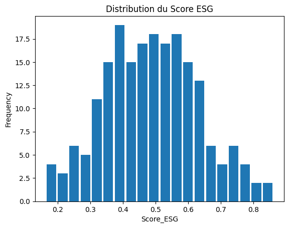
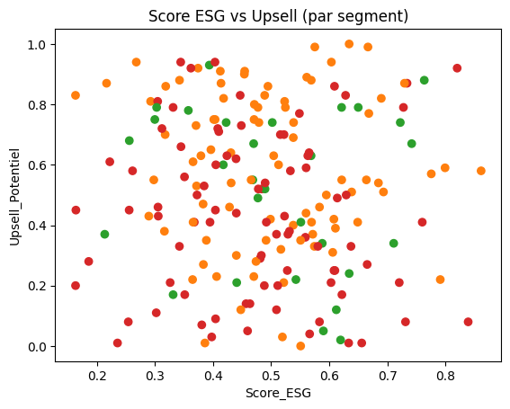

# 🌍 ESG Investor Segmentation
Score ESG pondéré et segmentation des investisseurs (KMeans, Python, Pandas, Scikit-learn)

## 🎯 Objectif
Ce projet illustre comment utiliser la data pour comprendre les comportements ESG (Environnement, Social, Gouvernance) des investisseurs et en tirer des **segments exploitables** pour la relation client et la stratégie produit.

L’idée : **scorer les investisseurs selon leur engagement ESG, les segmenter en profils homogènes, et analyser leur fidélité, churn et potentiel d’upsell**.

---

## 🧰 Données & Méthode
- **Données simulées** à partir de tendances observées dans la finance durable (AMF, Morningstar, Novethic).  
- Variables clés :
  - ESG : `%_Encours_ESG`, `Nb_Fonds_Labellises`, `Vote_AG_ESG`, etc.
  - Relation client : `NPS`, `Fidelite_Score`, `Churn`, `Upsell_Potentiel`
  - Profil : `Type_Investisseur`, `Pays`, `Encours_Millions`  
- **Méthodologie** :
  1. Normalisation des variables ESG  
  2. Calcul d’un **score ESG pondéré**  
  3. Segmentation KMeans (k=3) : regroupement d’investisseurs en segments homogènes, sans avoir besoin de définir à l’avance des classes.  
  4. Analyse descriptive par segment, type d’investisseur et pays.  

---

## 📊 Résultats clés
Trois segments principaux émergent de l’analyse :

- **Clients à convaincre** → ESG faible (0.47) mais fidélité élevée (0.77). Ce sont des clients stables mais pas encore convaincus par l’ESG.  
- **À potentiel latent** → ESG intermédiaire (0.50), meilleur potentiel d’upsell (0.58) et NPS positif (+0.37). Cible prioritaire pour la croissance.  
- **Champions ESG** → ESG le plus haut (0.51), mais NPS négatif (-4.41) et churn observé (1.0). Ce segment est engagé mais insatisfait → risque de départ.  

### Chiffres clés
- 📌 Fidélité la plus élevée : 0.77 (Clients à convaincre)  
- 📌 Potentiel d’upsell max : 0.58 (À potentiel latent)  
- 📌 Churn observé : 1.0 (Champions ESG)  

---

## 📈 Visualisations

  
  

---

## 📦 Outputs
- `notebooks/esg_segmentation.ipynb` → Notebook Colab (code complet)  
- `outputs/clients_esg_segmentes.csv` → Fichier final avec score ESG + segments  
- `outputs/resume_segments.csv` → Tableau de synthèse par segment  
- `visuals/*.png` → Graphiques (histogramme, scatter)

---

## 🛠️ Stack
- Python (pandas, scikit-learn, matplotlib)  
- Jupyter/Colab  

---

## 🚀 Perspectives
- Ajouter d’autres variables relationnelles (ex : satisfaction produit)  
- Connecter à un dashboard Power BI pour suivi dynamique  
- Tester d’autres algorithmes de clustering (DBSCAN, CAH)  

---

👉 **So what?**  
Ce projet illustre comment une société de gestion peut **mieux cibler ses clients ESG**, sécuriser les segments à risque et développer ceux à potentiel.

